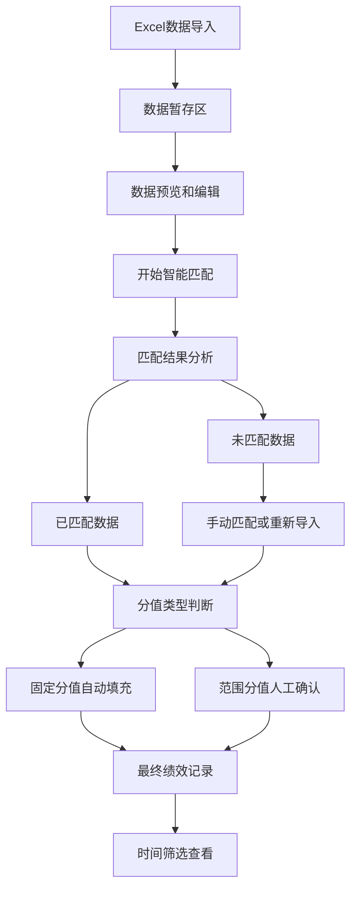

# 绩效登记页面功能升级需求文档

## 1. 产品概述

绩效登记页面需要进行全面升级，从简单的手动录入模式升级为智能化的数据导入和匹配系统。新系统将支持Excel批量导入检查问题数据，通过智能匹配算法自动关联绩效管理办法，并提供灵活的分值处理和时间筛选功能，大幅提升绩效登记的效率和准确性。

## 2. 核心功能

### 2.1 用户角色
本功能主要面向绩效管理员和HR人员，无需区分不同权限角色。

### 2.2 功能模块

升级后的绩效登记页面包含以下核心模块：

1. **数据导入管理页面**：Excel导入、数据预览、批量操作
2. **智能匹配处理页面**：匹配算法执行、结果展示、人工调整
3. **绩效记录管理页面**：最终记录查看、时间筛选、手动添加
4. **分值确认页面**：范围值分值的人工确认和调整

### 2.3 页面详情

| 页面名称 | 模块名称 | 功能描述 |
|----------|----------|----------|
| 数据导入管理 | Excel导入组件 | 支持上传Excel文件，解析包含工号、姓名、检查内容、月份、年份的数据 |
| 数据导入管理 | 暂存数据表格 | 显示导入的原始数据，支持查看、编辑、删除操作 |
| 数据导入管理 | 批量操作工具栏 | 提供全选、批量删除、数据验证等功能 |
| 智能匹配处理 | 匹配算法引擎 | 根据检查内容关键词匹配对应的绩效管理办法条目 |
| 智能匹配处理 | 匹配结果展示 | 显示工号、姓名、岗位、检查内容、项目名称、项目分值、项目编号、纸质编号 |
| 智能匹配处理 | 未匹配数据处理 | 单独展示未匹配成功的数据，支持手动匹配或重新导入 |
| 分值确认页面 | 固定分值处理 | 自动填充固定数值到加减分列 |
| 分值确认页面 | 范围分值处理 | 显示分值范围，提供人工输入框进行确认 |
| 分值确认页面 | 批量确认工具 | 支持批量设置相同类型问题的分值 |
| 绩效记录管理 | 时间筛选器 | 年月选择组件，筛选特定时间段的记录 |
| 绩效记录管理 | 记录列表 | 展示最终确认的绩效记录，支持编辑和删除 |
| 绩效记录管理 | 手动添加功能 | 支持直接手动录入新的绩效记录 |

## 3. 核心流程

### 3.1 数据导入流程

用户首先通过Excel导入功能上传包含检查问题的数据文件。系统解析Excel文件，提取工号、姓名、检查内容、月份、年份等字段，将数据暂存到临时表中。用户可以在暂存区查看导入的数据，进行必要的编辑和删除操作，确保数据质量。

### 3.2 智能匹配流程

点击"开始匹配"按钮后，系统启动智能匹配算法。算法通过分析检查内容中的关键词，在绩效管理办法数据库中查找匹配的条目。匹配成功的数据将显示完整的绩效信息，包括员工基本信息和对应的绩效条目详情。未匹配成功的数据将单独列出，等待人工处理。

### 3.3 分值处理流程

对于匹配成功的数据，系统根据项目分值类型进行不同处理。固定数值直接填充到加减分列，范围值则显示范围信息并留空等待人工确认。用户可以批量处理相同类型的分值确认，提高操作效率。

### 3.4 增量处理流程

当需要多次导入或添加新的检查内容时，系统支持增量处理模式。用户可以选择仅对未匹配的内容进行匹配处理，已匹配的内容保持不变，避免重复工作。



## 4. 用户界面设计

### 4.1 设计风格

- **主色调**：#1890ff（蓝色）作为主色，#52c41a（绿色）作为成功状态色
- **辅助色**：#faad14（橙色）用于警告，#f5222d（红色）用于错误提示
- **按钮样式**：采用Ant Design的现代化按钮设计，圆角4px
- **字体**：14px为主要字体大小，12px为辅助信息字体
- **布局风格**：卡片式布局，清晰的模块分区
- **图标风格**：使用Ant Design图标库，保持一致性

### 4.2 页面设计概览

| 页面名称 | 模块名称 | UI元素 |
|----------|----------|--------|
| 数据导入管理 | 导入区域 | 拖拽上传组件，支持.xlsx/.xls格式，蓝色边框，上传图标居中 |
| 数据导入管理 | 数据表格 | 斑马纹表格，固定表头，支持排序和筛选，操作列包含编辑和删除按钮 |
| 数据导入管理 | 操作工具栏 | 顶部工具栏包含全选复选框、批量删除按钮、数据统计信息 |
| 智能匹配处理 | 匹配按钮 | 大号主色调按钮，居中显示，包含匹配图标和加载状态 |
| 智能匹配处理 | 结果展示区 | 分为已匹配和未匹配两个Tab页，使用不同颜色标识状态 |
| 分值确认页面 | 分值输入区 | 范围值显示为标签形式，输入框紧邻显示，支持批量操作 |
| 绩效记录管理 | 时间选择器 | 年月选择组件，位于页面顶部，支持快速选择常用时间段 |
| 绩效记录管理 | 记录表格 | 完整的绩效信息展示，支持内联编辑，状态用不同颜色的标签显示 |

### 4.3 响应式设计

系统采用桌面优先的响应式设计，主要面向PC端用户。在平板设备上保持良好的可用性，表格支持横向滚动，确保所有功能在不同屏幕尺寸下都能正常使用。

## 5. 数据结构设计

### 5.1 检查问题暂存表 (check_issues_temp)

```sql
CREATE TABLE check_issues_temp (
    id INTEGER PRIMARY KEY AUTOINCREMENT,
    emp_no VARCHAR(20) NOT NULL,
    emp_name VARCHAR(50) NOT NULL,
    check_content TEXT NOT NULL,
    check_month VARCHAR(7) NOT NULL, -- YYYY-MM格式
    check_year VARCHAR(4) NOT NULL,
    import_batch VARCHAR(50), -- 导入批次标识
    is_matched BOOLEAN DEFAULT FALSE,
    created_at DATETIME DEFAULT CURRENT_TIMESTAMP,
    updated_at DATETIME DEFAULT CURRENT_TIMESTAMP
);
```

### 5.2 匹配结果表 (match_results)

```sql
CREATE TABLE match_results (
    id INTEGER PRIMARY KEY AUTOINCREMENT,
    temp_issue_id INTEGER NOT NULL,
    item_id INTEGER NOT NULL,
    match_score DECIMAL(3,2), -- 匹配度分数
    final_score DECIMAL(5,2), -- 最终确认分值
    score_status VARCHAR(20) DEFAULT 'pending', -- pending/confirmed
    match_type VARCHAR(20) DEFAULT 'auto', -- auto/manual
    created_at DATETIME DEFAULT CURRENT_TIMESTAMP,
    updated_at DATETIME DEFAULT CURRENT_TIMESTAMP,
    FOREIGN KEY (temp_issue_id) REFERENCES check_issues_temp(id),
    FOREIGN KEY (item_id) REFERENCES items(id)
);
```

### 5.3 匹配关键词表 (match_keywords)

```sql
CREATE TABLE match_keywords (
    id INTEGER PRIMARY KEY AUTOINCREMENT,
    item_id INTEGER NOT NULL,
    keyword VARCHAR(100) NOT NULL,
    weight DECIMAL(3,2) DEFAULT 1.0, -- 关键词权重
    created_at DATETIME DEFAULT CURRENT_TIMESTAMP,
    FOREIGN KEY (item_id) REFERENCES items(id)
);
```

## 6. 技术实现要点

### 6.1 智能匹配算法

采用基于关键词权重的文本匹配算法，通过预设的关键词库对检查内容进行分析。算法支持模糊匹配和同义词识别，提高匹配准确率。匹配结果按照相似度评分排序，超过阈值的自动匹配，低于阈值的标记为待人工确认。

### 6.2 数据导入处理

使用SheetJS库解析Excel文件，支持多种Excel格式。导入过程包含数据验证，检查必填字段、数据格式和重复性。提供详细的导入日志，帮助用户识别和修正数据问题。

### 6.3 批量操作优化

对于大量数据的批量操作，采用分页处理和异步执行机制，避免界面卡顿。提供操作进度提示和取消功能，提升用户体验。

### 6.4 数据持久化

暂存数据支持本地存储，用户可以随时保存和恢复工作进度。最终确认的数据写入正式的绩效记录表，确保数据的完整性和一致性。