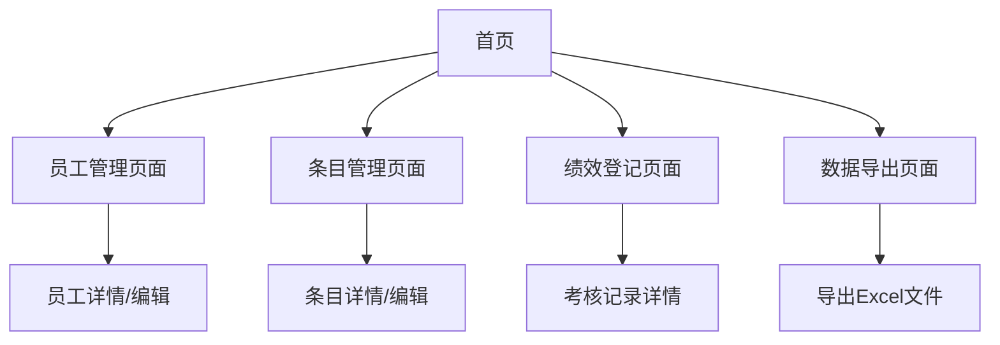

# 绩效考核系统产品需求文档

## 1. Product Overview
绩效考核系统是一个单机版前端应用，用于企业内部员工绩效管理和考核记录。系统支持员工信息管理、考核条目设置、绩效登记和数据导出功能，所有数据保存在浏览器本地存储中，无需后端服务器支持。

系统主要解决企业绩效考核数据管理分散、统计困难的问题，为HR和管理人员提供便捷的绩效管理工具。目标是提高绩效考核效率，规范考核流程，便于数据统计和分析。

## 2. Core Features

### 2.1 User Roles
本系统为单机版应用，不区分用户角色，所有功能对使用者开放。

### 2.2 Feature Module
我们的绩效考核系统包含以下主要页面：
1. **员工管理页面**：员工信息展示、新增编辑删除、Excel导入导出、搜索筛选功能。
2. **条目管理页面**：考核条目展示、新增编辑删除、状态管理、Excel导入导出、搜索筛选功能。
3. **绩效登记页面**：月份选择、员工列表、考核记录管理、批量导入功能。
4. **数据导出页面**：月份和条件筛选、车间Excel导出、系统Excel导出功能。

### 2.3 Page Details

| Page Name | Module Name | Feature description |
|-----------|-------------|---------------------|
| 员工管理页面 | 员工信息表格 | 展示员工列表，支持分页、排序，显示姓名、工号、岗位、车站、区域、车间、中心、公司等字段 |
| 员工管理页面 | 员工操作功能 | 新增员工信息、编辑现有员工、删除员工记录，表单验证和数据校验 |
| 员工管理页面 | Excel导入导出 | 下载员工模板、上传Excel文件批量导入、导出当前员工数据为Excel |
| 员工管理页面 | 搜索筛选 | 按工号、姓名、车站、中心、车间等条件搜索和筛选员工 |
| 条目管理页面 | 条目信息表格 | 展示考核条目列表，显示纸质编号、项目编号、项目名称、分类、分值、说明、状态、分组等字段 |
| 条目管理页面 | 条目操作功能 | 新增考核条目、编辑现有条目、删除条目、启用停用状态切换 |
| 条目管理页面 | Excel导入导出 | 下载条目模板、上传Excel文件批量导入、导出当前条目数据为Excel |
| 条目管理页面 | 搜索筛选 | 按编号、名称、分类、状态等条件搜索和筛选条目 |
| 绩效登记页面 | 月份选择器 | 选择考核月份，切换不同月份的考核数据 |
| 绩效登记页面 | 员工列表 | 左侧显示员工列表，支持搜索，点击选择员工查看其考核记录 |
| 绩效登记页面 | 考核记录管理 | 右侧显示选中员工的当月考核记录，支持新增、编辑、删除记录 |
| 绩效登记页面 | 记录新增功能 | 选择考核条目自动带出分值，可修改分值，填写登记说明，保存记录 |
| 绩效登记页面 | 批量导入 | 上传Excel文件批量导入考核记录，包含工号、项目编号、月份、加减分、说明 |
| 数据导出页面 | 筛选条件 | 选择导出月份，按区域、中心、车间、车站等条件筛选数据 |
| 数据导出页面 | 车间Excel导出 | 导出包含工号、中心、姓名、岗位、绩效加分、扣减得分、考核结果、考核内容、车站的Excel |
| 数据导出页面 | 系统Excel导出 | 导出包含工号、姓名、项目编号、项目名称、项目分值、项目说明、加减分、登记说明的Excel |

## 3. Core Process

主要用户操作流程如下：

**员工管理流程**：用户进入员工管理页面，可以查看现有员工列表，通过搜索功能快速定位特定员工。用户可以手动新增员工信息，或通过Excel模板批量导入员工数据。对于现有员工，支持编辑基本信息和删除操作。

**条目管理流程**：用户进入条目管理页面，查看和管理考核条目。可以新增考核条目设置分值和说明，或通过Excel批量导入条目。对现有条目可以编辑信息、启用停用状态，以及删除不需要的条目。

**绩效登记流程**：用户选择考核月份，从左侧员工列表选择要考核的员工，右侧显示该员工当月的考核记录。用户可以新增考核记录，选择考核条目后系统自动填入默认分值，用户可修改分值并填写登记说明。也支持通过Excel批量导入考核记录。

**数据导出流程**：用户设置导出条件包括月份和筛选条件，选择导出格式（车间Excel或系统Excel），系统生成相应格式的Excel文件供下载。

## 4. User Interface Design

### 4.1 Design Style
- 主色调：蓝色系（#1890ff）作为主色，灰色系（#f0f2f5）作为背景色
- 按钮样式：圆角按钮，主要操作使用蓝色，危险操作使用红色（#ff4d4f）
- 字体：系统默认字体，标题使用16px，正文使用14px，辅助文字使用12px
- 布局风格：卡片式布局，顶部导航栏，左侧菜单（绩效登记页面），表格展示数据
- 图标风格：使用Ant Design图标库，简洁线性图标风格

### 4.2 Page Design Overview

| Page Name | Module Name | UI Elements |
|-----------|-------------|-------------|
| 员工管理页面 | 页面头部 | 页面标题、新增员工按钮、Excel导入导出按钮，蓝色主题，16px标题字体 |
| 员工管理页面 | 搜索区域 | 搜索输入框、筛选下拉框，白色卡片背景，圆角边框 |
| 员工管理页面 | 数据表格 | 斑马纹表格，悬停高亮，操作列包含编辑删除按钮，分页器 |
| 条目管理页面 | 页面头部 | 页面标题、新增条目按钮、Excel导入导出按钮，与员工页面保持一致 |
| 条目管理页面 | 搜索筛选 | 多条件筛选表单，状态标签使用绿色（启用）和红色（停用） |
| 条目管理页面 | 数据表格 | 表格展示条目信息，状态列使用标签组件，操作列包含编辑删除启停按钮 |
| 绩效登记页面 | 月份选择 | 顶部月份选择器，蓝色主题，居中布局 |
| 绩效登记页面 | 左侧员工列表 | 固定宽度侧边栏，员工卡片列表，选中状态高亮显示 |
| 绩效登记页面 | 右侧记录区域 | 考核记录表格，新增记录表单，批量导入按钮 |
| 数据导出页面 | 筛选表单 | 月份选择器、多级联动筛选，表单布局，白色卡片背景 |
| 数据导出页面 | 导出按钮 | 两个大按钮，车间导出（蓝色）、系统导出（绿色），居中布局 |

### 4.3 Responsiveness
系统主要面向桌面端使用，采用桌面优先设计。在平板设备上进行适配，确保表格和表单在中等屏幕上正常显示。移动端提供基本浏览功能，但主要操作建议在桌面端进行。