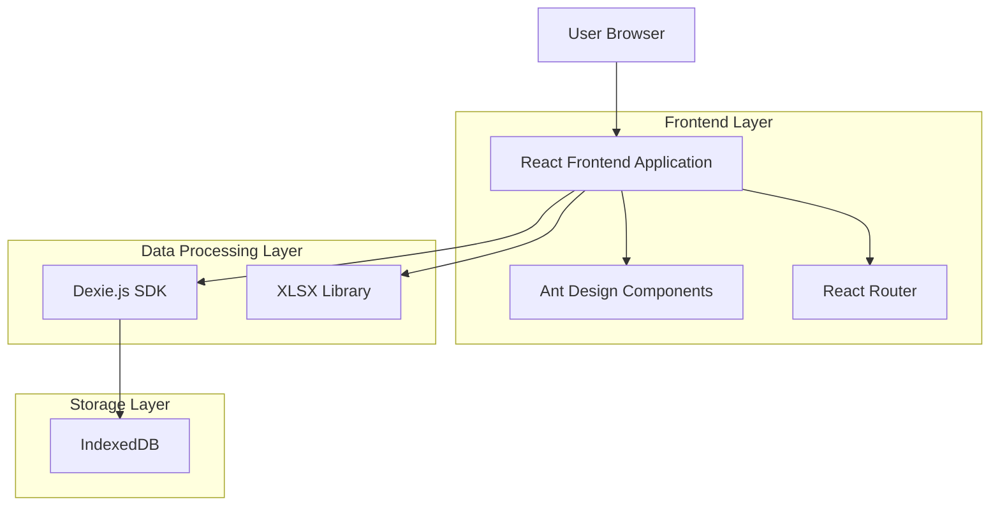
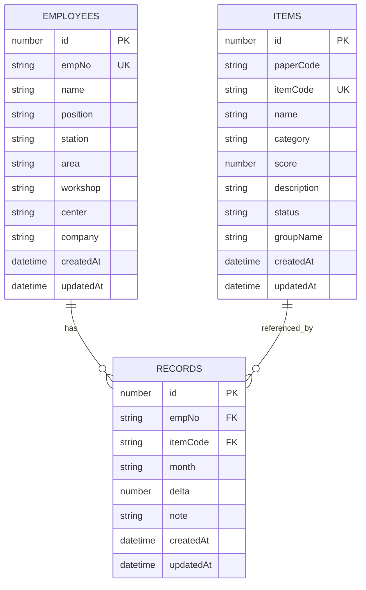

# 绩效考核系统技术架构文档

## 1. Architecture design



## 2. Technology Description

- Frontend: React@18 + TypeScript@5 + Vite@5 + Ant Design@5
- Data Storage: IndexedDB (via Dexie.js@3)
- Excel Processing: xlsx@0.18
- Date Handling: dayjs@1.11
- Routing: React Router@6
- Build Tool: Vite

## 3. Route definitions

| Route | Purpose |
|-------|----------|
| / | 首页，显示系统概览和导航菜单 |
| /employees | 员工管理页面，员工信息的增删改查和Excel导入导出 |
| /items | 条目管理页面，考核条目的管理和Excel导入导出 |
| /records | 绩效登记页面，员工考核记录的登记和管理 |
| /export | 数据导出页面，生成车间和系统Excel报表 |

## 4. API definitions

### 4.1 Core API

由于系统为单机版前端应用，所有数据操作通过IndexedDB进行，以下为主要的数据操作接口：

**员工数据操作**
```typescript
// 获取所有员工
db.employees.toArray(): Promise<Employee[]>

// 添加员工
db.employees.add(employee: Employee): Promise<number>

// 更新员工
db.employees.update(id: number, changes: Partial<Employee>): Promise<number>

// 删除员工
db.employees.delete(id: number): Promise<void>

// 按条件搜索员工
db.employees.filter(predicate: (employee: Employee) => boolean): Promise<Employee[]>
```

**考核条目数据操作**
```typescript
// 获取所有条目
db.items.toArray(): Promise<Item[]>

// 添加条目
db.items.add(item: Item): Promise<number>

// 更新条目
db.items.update(id: number, changes: Partial<Item>): Promise<number>

// 删除条目
db.items.delete(id: number): Promise<void>

// 按状态筛选条目
db.items.where('status').equals(status: string): Promise<Item[]>
```

**考核记录数据操作**
```typescript
// 获取指定员工指定月份的记录
db.records.where(['empNo', 'month']).equals([empNo: string, month: string]): Promise<Record[]>

// 添加考核记录
db.records.add(record: Record): Promise<number>

// 更新考核记录
db.records.update(id: number, changes: Partial<Record>): Promise<number>

// 删除考核记录
db.records.delete(id: number): Promise<void>

// 批量添加记录
db.records.bulkAdd(records: Record[]): Promise<number>
```

## 5. Data model

### 5.1 Data model definition



### 5.2 Data Definition Language

**员工表 (employees)**
```typescript
// Dexie表定义
class PerformanceDB extends Dexie {
  employees!: Table<Employee>;
  items!: Table<Item>;
  records!: Table<Record>;

  constructor() {
    super('PerformanceDB');
    this.version(1).stores({
      employees: '++id, empNo, name, position, station, area, workshop, center, company, createdAt, updatedAt',
      items: '++id, paperCode, itemCode, name, category, score, description, status, groupName, createdAt, updatedAt',
      records: '++id, empNo, itemCode, month, delta, note, createdAt, updatedAt'
    });
  }
}

// 数据类型定义
interface Employee {
  id?: number;
  empNo: string;        // 工号
  name: string;         // 姓名
  position: string;     // 岗位
  station: string;      // 车站
  area: string;         // 区域
  workshop: string;     // 车间
  center: string;       // 中心
  company: string;      // 公司
  createdAt?: Date;
  updatedAt?: Date;
}

interface Item {
  id?: number;
  paperCode: string;    // 纸质编号
  itemCode: string;     // 项目编号
  name: string;         // 项目名称
  category: string;     // 项目分类
  score: number;        // 项目分值
  description: string;  // 项目说明
  status: string;       // 项目状态 (启用/停用)
  groupName: string;    // 分组名称
  createdAt?: Date;
  updatedAt?: Date;
}

interface Record {
  id?: number;
  empNo: string;        // 工号
  itemCode: string;     // 项目编号
  month: string;        // 月份 (YYYY-MM格式)
  delta: number;        // 加减分
  note: string;         // 登记说明
  createdAt?: Date;
  updatedAt?: Date;
}

// 初始化数据库
const db = new PerformanceDB();

// 创建索引
db.employees.hook('creating', function (primKey, obj, trans) {
  obj.createdAt = new Date();
  obj.updatedAt = new Date();
});

db.employees.hook('updating', function (modifications, primKey, obj, trans) {
  modifications.updatedAt = new Date();
});

db.items.hook('creating', function (primKey, obj, trans) {
  obj.createdAt = new Date();
  obj.updatedAt = new Date();
});

db.items.hook('updating', function (modifications, primKey, obj, trans) {
  modifications.updatedAt = new Date();
});

db.records.hook('creating', function (primKey, obj, trans) {
  obj.createdAt = new Date();
  obj.updatedAt = new Date();
});

db.records.hook('updating', function (modifications, primKey, obj, trans) {
  modifications.updatedAt = new Date();
});
```

**Excel模板结构定义**
```typescript
// 员工导入模板
interface EmployeeImportTemplate {
  姓名: string;
  工号: string;
  岗位: string;
  车站: string;
  区域: string;
  车间: string;
  中心: string;
  公司: string;
}

// 条目导入模板
interface ItemImportTemplate {
  纸质编号: string;
  项目编号: string;
  项目名称: string;
  项目分类: string;
  项目分值: number;
  项目说明: string;
  项目状态: string;
  分组名称: string;
}

// 记录导入模板
interface RecordImportTemplate {
  工号: string;
  项目编号: string;
  月份: string;
  加减分: number;
  登记说明: string;
}

// 车间导出格式
interface WorkshopExportFormat {
  工号: string;
  中心: string;
  姓名: string;
  岗位: string;
  绩效加分: number;
  扣减得分: number;
  月度绩效考核结果: number;
  考核内容: string;
  车站: string;
}

// 系统导出格式
interface SystemExportFormat {
  工号: string;
  姓名: string;
  项目编号: string;
  项目名称: string;
  项目分值: number;
  项目说明: string;
  加减分: number;
  登记说明: string;
}
```